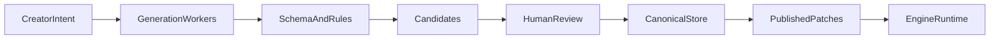

# Aether Engine — Grand design

**Purpose:** Long-term reference. Do not treat every section as “build now.”  
**Actionable work:** [Near-term plan](aether_engine_near_term.plan.md)  
**Phased history:** [Roadmap index](aether_engine_roadmap.plan.md)

---

## North star

**Aether is “Cursor for game worlds.”**

A creator describes intent in natural language. The system produces **reviewable, structured changes** to a canonical world project—geometry, props, NPCs, mechanics, art—and a **running game** updates live when changes are approved.

The product is not “an AI that plays Unity.” It is:

- A **custom runtime** that simulates data-defined worlds
- An **AI content plane** that generates and governs packages and patches
- An **authoring studio** for review, diff, and publish
- Eventually: **spatial editing**, **asset generation**, and **multiplayer** fanout

---

## Core product loop (never violate)

1. All AI output is **structured** (JSON patches, package fragments, asset manifests).
2. Nothing reaches live players without **validation** (and usually human publish).
3. Runtime and plane communicate only via **packages, patches, and events**—testable, swappable.

---

## Three-layer architecture (stable)

| Layer | Responsibility | Technology (current) |
|-------|----------------|----------------------|
| **Runtime** | Simulate, render, input, apply patches at tick boundary | Rust, Bevy, `aether_*` crates |
| **Content plane** | Canonical store, workers, rules, SSE fanout | `aether_plane`, filesystem → DB later |
| **Studio** | Review, prompt, publish, rollback, spatial preview | Web UI → richer app later |

Games are **not** Rust forks. They are **`GamePackage` instances** plus published patch history.

---

## World ontology (grows over time)

Everything AI and tools may author must map to package sections:

| Section | Now | Target |
|---------|-----|--------|
| `meta` | id, version, style | style profiles, biome tags, tone |
| `scenes` | id, name | bounds, lighting, biome |
| `entities` | transform, player, collectible | props, NPCs, triggers, AI hooks |
| `mechanics` | stub | triggers, conditions, effects |
| `content` | stub | quests, dialogue, rewards |
| `assets` | stub | sprites, meshes, audio, provenance |
| **spatial** (future) | — | tilemaps, rooms, dungeon modules, terrain chunks |

**Patch ops** grow with ontology: `upsert_entity` today → `upsert_room`, `paint_tiles`, `place_prop`, `upsert_mechanic`, …

---

## AI workers (content plane)

| Worker | Input | Output |
|--------|-------|--------|
| **World** | “Add a mossy dungeon wing north of the grove” | Patch ops (rooms, tiles, entities) |
| **Art** | “Rustic wooden chest, 64×64, top-down” | Image files + `assets` entries |
| **Narrative** | “Quest to find the hidden shard” | `content` fragments |
| **Mechanic** | “Unlock path when player explores 2 min” | `mechanics` rules |
| **Director** | Gameplay event stream | Patch **intents** (candidates) |

Workers share: schema registry, rule engine, repair pass, candidate queue.

Real LLMs and image models are **plugins** behind the same candidate → publish API.

---

## Physical worlds (terrain, buildings, dungeons)

**Principle:** Spatial structure is **data first**, renderer second.

| Stage | Capability |
|-------|------------|
| **v0 (now)** | 2D entities, top-down movement |
| **v1** | Rooms + tile regions in package; 2D map render |
| **v2** | Props with art assets; biome rules |
| **v3** | Dungeon **modules** (prefab graphs) + connection rules |
| **v4** | Heightfield / mesh terrain references (still data-driven) |
| **v5** | Full 3D presentation; same patch protocol |

Procedural generation must respect **connectivity, budgets, and style profiles**—not raw noise without validation.

---

## Art pipeline

- Generated assets land in **canonical store** with provenance (prompt, model, seed).
- Packages reference assets by **id** only; no embedded binary in JSON.
- Studio shows thumbnails and rejects assets that fail dimension/style rules.
- Runtime loads through normal asset pipeline (Bevy `AssetServer` → later custom).

---

## Design constitution (game feel)

Long-term games obey [engine-constitution.md](../../docs/engine-constitution.md):

- Exploration pays off
- Hidden progression from playstyle
- Persistence with rollback
- AI accelerates, humans govern
- Stable reward economy

Engine features exist to **enforce** these, not as optional flavor.

---

## Phased arc (years, not weeks)

| Phase | Theme | Exit signal |
|-------|--------|-------------|
| **0** | Genesis | Docs, crates, formats |
| **1** | Runtime kernel | Play from JSON, hot reload |
| **2** | Live plane | Studio publish → running game |
| **3** | AI authoring | Real prompts → validated patches |
| **4** | Spatial + art | Rooms/tiles + generated sprites in world |
| **5** | Editor | In-engine inspection and placement |
| **6** | Multiplayer | Authoritative patch fanout, sessions |

**Anti-goals until Phase 4+:** MMO infrastructure, full 3D engine rewrite, unvalidated AI direct-to-runtime.

---

## Technical anchors (unlikely to change)

- **Rust** for runtime (performance, safety)
- **Bevy** as ECS/render substrate until package model outgrows it
- **JSON** (or derived schemas) for authoring; binary bundles optional later
- **Plane separate from player** — always
- **Patches** small, versioned, reversible

---

## Success: “Cursor for worlds”

We have arrived when a creator can:

1. Open Studio, describe a dungeon wing in prose
2. Review generated layout + art + mechanics as **candidates**
3. Publish → see it live in `aether_player` without recompiling the engine
4. Iterate with follow-up prompts as **patches**, with history and rollback
5. Ship a **new game** as a new `GamePackage`, not a fork of engine code

---

## Document map

| Doc | Role |
|-----|------|
| [engine-constitution.md](../../docs/engine-constitution.md) | Game design law |
| [package-format.md](../../docs/package-format.md) | Authoring ontology |
| [patch-protocol.md](../../docs/patch-protocol.md) | Live update contract |
| [content-plane.md](../../docs/content-plane.md) | Plane API |
| [ai-authoring.md](../../docs/ai-authoring.md) | Generation workers |
| **Near-term plan** | What to build now |
| **This file** | Why we build it |
